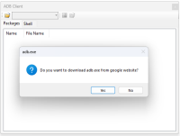
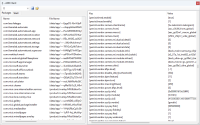

# Android Debug Bridge Package Manager

UI plugin for working with Android Debug Bridge (ADB) with extended package management and inspection features.
The main reason to create this plugin was to upload APK files to the Oculus Quest 2 device without using the command line.
The plugin also provides additional features such as viewing the internal structure of APK files and extracting them from the device.

## Key Features

- List installed packages on connected devices
- Install / uninstall / update APK packages
- View APK internal structure (resources, manifest, certificates)
- Extract / export APKs from device
- Open / close APK in dedicated viewer plugin
- Multi-target build: .NET Framework 4.8 and .NET 8
- Designed as SAL.Flatbed plugin

## Requirements

- Android SDK Platform Tools (adb available in PATH or will be downloaded to local folder)
- .NET Framework 4.8 (legacy target) or .NET 8 (modern target)
- Windows OS (for net8.0-windows target)

## Installation

1. Download the release archive (.zip or .nupkg).
2. Place the plugin assembly into the host application plugin directory (SAL / host supporting Windows environment):
	- [Flatbed.Dialog](https://dkorablin.github.io/Flatbed-Dialog/)
	- [Flatbed.Dialog (Lite)](https://dkorablin.github.io/Flatbed-Dialog-Lite)
	- [Flatbed.MDI](https://dkorablin.github.io/Flatbed-MDI)
	- [Flatbed.MDI (WPF)](https://dkorablin.github.io/Flatbed-MDI-Avalon)
3. Restart the host application; Plugin.AdbPackageManager should appear in the plugin list (Tools -> ADB Client).

## Usage

1. Ensure a device is connected and visible via `adb devices`.
2. Load the plugin inside the host application.
3. Use the UI to:
	- Refresh package list
	- Install / uninstall APK files (Resource files will be uploaded to the device automatically)
	- Open an APK to inspect its contents (delegates to APK viewer plugin)
4. Close APK when finished to release resources.

## Related Plugin Integration

This plugin calls another plugin [APK Image View](https://github.com/DKorablin/Plugin.ApkImageView) by ID to open/close APK files. Ensure the viewer plugin with ID `ca0bd89a-318f-4fa3-9a5e-49b3e1358a53` is present if you want file inspection features.

## Building

- Multi-target configuration is defined in the project file.
- Restore packages then build:
	- Visual Studio: regular Build
	- CLI: `dotnet build` (net8 target) and MSBuild for .NET Framework if needed.

## Logging & Diagnostics

Errors (e.g., missing required plugins) are traced via `PluginWindows.Trace`.
Use debug output / tracing listeners to capture runtime diagnostics.

## Disclaimer

ADB must be installed separately. This project does not bundle Android platform tools.